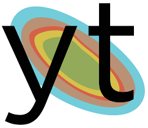
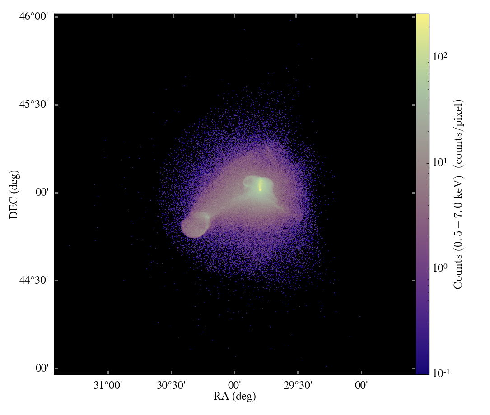
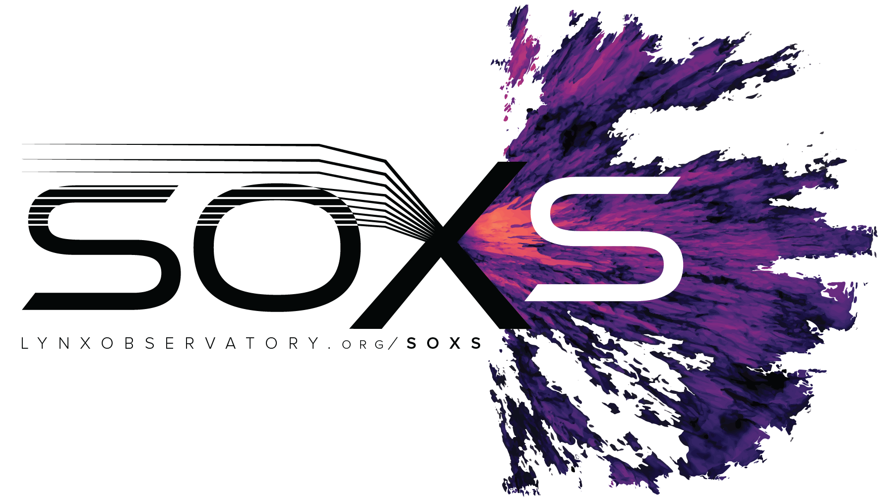
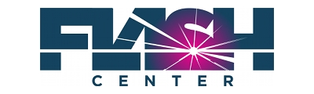
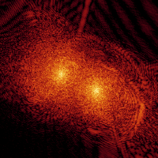

### The yt Project

yt is an open-source, permissively-licensed python package for analyzing and visualizing volumetric data. yt supports structured, variable-resolution meshes, unstructured meshes, and discrete or sampled data such as particles. Focused on driving physically-meaningful inquiry, yt has been applied in domains such as astrophysics, seismology, nuclear engineering, molecular dynamics, and oceanography. 

[Main Page](https://yt-project.org)  
[GitHub](https://github.com/yt-project/yt)

### pyXSIM

pyXSIM is a Python package for simulating X-ray emission from astrophysical sources. pyXSIM makes it possible to generate synthetic X-ray observations of these sources from a wide variety of models, whether from grid-based simulation codes such as FLASH, Enzo, and Athena, to particle-based codes such as Gadget and AREPO, and even from datasets that have been created “by hand”, such as from NumPy arrays. pyXSIM also provides facilities for manipulating the synthetic observations it produces in various ways, as well as ways to export the simulated X-ray events to other software packages to simulate the end products of specific X-ray observatories.

[Main Page](https://hea-www.cfa.harvard.edu/~jzuhone/pyxsim)  
[GitHub](https://github.com/jzuhone/pyxsim)

### SOXS

SOXS is a software suite which creates simulated X-ray observations of astrophysical sources. The goal of SOXS is to provide a comprehensive set of tools to design source models and convolve them with simulated models of X-ray observatories. In particular, SOXS is the primary simulation tool for simulations of Lynx and Line Emission Mapper observations.

[Main Page](https://hea-www.cfa.harvard.edu/soxs)  
[GitHub](https://github.com/lynx-x-ray-observatory/soxs)

### FLASH

The FLASH Code is adaptive-mesh refinement N-body/hydrodynamics/multiphysics parallel code for the simulation of plasma physics and astrophysics.

[Main Page](https://flash.rochester.edu)

### GAMER

The GAMER Code is adaptive-mesh refinement N-body/hydrodynamics GPU-accelerated parallel code for astrophysics simulations.

[GitHub](https://github.com/gamer-project/gamer)

